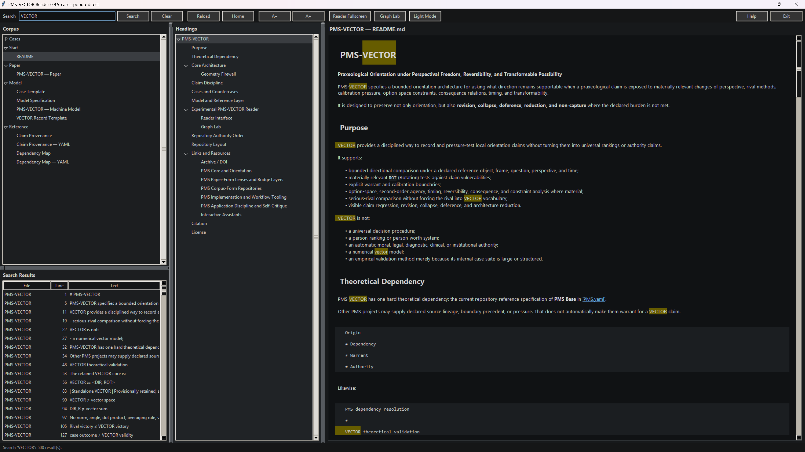
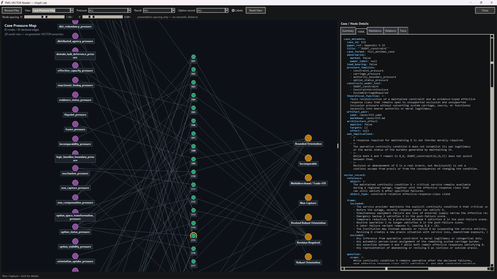

# PMS-VECTOR

**Praxeological Orientation under Perspectival Freedom, Reversibility, and Transformable Possibility**

PMS-VECTOR specifies a bounded orientation architecture for asking what direction remains supportable when a praxeological claim is exposed to materially relevant changes of perspective, rival methods, calibration pressure, option-space constraints, consequence relations, timing, and transformability.

It is designed to preserve not only orientation, but also **revision, collapse, deference, reduction, and non-capture** where the declared burden is not met.

---

## Purpose

VECTOR provides a disciplined way to record and pressure-test local orientation claims without turning them into universal rankings or authority claims.

It supports:

- bounded directional comparison under a declared reference object, frame, question, perspective, and time;
- materially relevant `ROT` (Rotation) tests against claim vulnerabilities;
- explicit warrant and calibration boundaries;
- option-space, second-order agency, timing, reversibility, consequence, and constraint analysis where material;
- serious-rival comparison without forcing the rival into VECTOR vocabulary;
- visible claim regression, revision, collapse, deference, and architecture reduction.

VECTOR is not:

- a universal decision procedure;
- a person-ranking or person-worth system;
- an automatic moral, legal, diagnostic, clinical, or institutional authority;
- a numerical vector model;
- an empirical validation method merely because its internal case suite is large or structured.

---

## Theoretical Dependency

PMS-VECTOR has one hard theoretical dependency: the current repository-reference specification of **PMS Base** in [`PMS.yaml`](https://raw.githubusercontent.com/tz-dev/Praxeological-Meta-Structure-Theory/refs/heads/main/model/PMS.yaml).

Other PMS projects may supply declared source lineage, boundary precedent, or pressure. That does not automatically make them warrant for a VECTOR claim.

```text
Origin
≠ Dependency
≠ Warrant
≠ Authority
```

Likewise:

```text
PMS dependency resolution
≠
VECTOR theoretical validation
```

---

### Reader Interface



### Graph Interface



---

## Core Architecture

The retained VECTOR core is:

```text
VECTOR := <DIR, ROT>
```

A concrete state is represented as:

```text
V_t(O | F, Q, π) := <DIR_t, RP_t>
RP_t := ROTProfile_t
```

where:

- `DIR` (Direction) records a bounded, warrant-dependent orientation relation;
- `ROT` (Rotation) is the family of perspective-changing pressure operations;
- `RP` is the stored rotation profile and is not itself the operation;
- `DIST` is **derived supporting only**, not a third core component.

Current architecture status:

| Construct | Status |
| --- | --- |
| `DIR` | Core; retained with narrowed scope |
| `ROT` | Core; retained with narrowed scope |
| `DIR_t` | Concrete state |
| `RP_t` | Stored rotation-profile state |
| `DIST` | Derived supporting only |
| Adult Orientation | Supporting shorthand only |
| Standalone VECTOR | Provisionally retained; scope-reduced |

### Geometry Firewall

The notation is structural, not geometric.

```text
VECTOR ≠ vector space
DIR ≠ signed scalar
ROT ≠ geometric rotation
DIST ≠ metric distance
DIR_R ≠ vector sum
```

---

No norm, angle, dot product, averaging rule, vector addition, or geometric invertibility is implied.

## Claim Discipline

A directional claim is local to its declared comparison burden. Robust orientation requires more than a favorable baseline result: relevant vulnerabilities must be exposed to materially distinct pressure, serious rivals must retain a credible route to win, calibration and warrant must remain explicit, and known critical open pressure may not be silently deleted.

```text
Revision ≠ Survival
Rival victory ≠ VECTOR victory
Non-Capture ≠ failure to answer
```

Orientation also does not automatically create authority, responsibility, legitimacy, option availability, or person-level judgment.

---

## Cases and Countercases

The repository contains **23 paper-linked Appendix-E fixtures**, each represented as:

```text
cases/E##.yaml
cases/E##.md
```

The YAML is the structured case record; the Markdown file is its human-readable companion.

The suite is an internal conformance and adversarial fixture layer:

```text
case count ≠ evidential weight
case suite ≠ empirical validation
case outcome ≠ VECTOR validity
```

A correct case result may be Robust Orientation, Revision Required, Revised Robust Orientation, Bounded Orientation, Trade-Off, Incomparability, rival deference, architecture reduction, or Non-Capture.

Four cases are especially load-bearing:

| Case | Function |
| --- | --- |
| `E20` | Non-Capture |
| `E21` | Specialist rival superiority / domain-task deference |
| `E22` | DIST necessity test and architecture reduction |
| `E23` | Same-burden rival superiority and DIR/ROT/standalone scope reduction |

See [`cases/README.md`](cases/README.md) and [`cases/index.yaml`](cases/index.yaml) for the complete suite.

---

## Model and Reference Layer

The machine-readable and reference-facing artifacts are separated by function:

| Path | Role |
| --- | --- |
| [`model/PMS-VECTOR.yaml`](model/PMS-VECTOR.yaml) | Canonical machine-readable VECTOR representation |
| [`model/Model Specification.html`](model/Model%20Specification.html) | Human-readable technical specification |
| [`model/Model Specification.pdf`](model/Model%20Specification.pdf) | Publication/render form of the specification |
| [`model/VECTOR-Record.template.yaml`](model/VECTOR-Record.template.yaml) | Generic bounded audit/reference scaffold |
| [`model/Case.template.yaml`](model/Case.template.yaml) | Appendix-E case scaffold |
| [`reference/Claim Provenance.yaml`](reference/Claim%20Provenance.yaml) | Declared claim-source provenance |
| [`reference/Dependency Map.yaml`](reference/Dependency%20Map.yaml) | Declared dependency, failure, prohibited-inference, and reduction relations |

Machine-readable consistency does not establish substantive adequacy.

```text
record completeness ≠ claim correctness
schema-shaped consistency ≠ theoretical adequacy
provenance completeness ≠ warrant
```

---

## Experimental PMS-VECTOR Reader

The repository includes a dependency-free Tkinter Reader under `reader/`.

It can load the repository as a folder or ZIP and provides:

- Markdown and YAML reading;
- heading navigation and corpus-wide search;
- direct browsing of E01–E23;
- paired case inspection;
- Architecture & Status view;
- Dependency / Warrant graph;
- Case Pressure Map;
- Selected Case Trace;
- Reduction Graph;
- repository self-tests for declared cross-file consistency.

The Graph Lab deliberately avoids a pseudo-geometric VECTOR visualization. It displays declared dependencies, pressure relations, case traces, and reductions instead.

```text
reader parse success ≠ schema validation
reader self-test ≠ VECTOR validity
graph rendering ≠ analytical finding
visual spacing ≠ semantic distance
```

---

## Repository Authority Order

This `README.md` is an orientation and navigation document, not an independent theoretical authority.

```text
PMS.yaml
→ PMS-VECTOR.md
→ model/PMS-VECTOR.yaml
→ Model Specification
→ Templates / Reference Layer
→ Paper-linked Cases
→ Reader
```

Where a downstream artifact conflicts with the paper, the conflict must be exposed rather than silently reconciled.

## Repository Layout

```text
PMS-VECTOR/
├── README.md
├── PMS-VECTOR.md
├── PMS-VECTOR.html
├── PMS-VECTOR.pdf
├── model/
├── cases/
├── reference/
├── examples/
├── reader/
├── css/
├── img/
├── CITATION.cff
├── LICENSE
└── .zenodo.json
```

The paper owns VECTOR theory. Model, reference, case, and reader artifacts make that theory more inspectable; they do not acquire greater authority through formalization or implementation.

---

## Links and Resources

### Archive / DOI

| Resource | Description |
| --- | --- |
| PMS Theory DOI | [](https://doi.org/10.5281/zenodo.17897220) |

### PMS Core and Orientation

| Resource | Description |
| --- | --- |
| [PMS Theory / Repository](https://github.com/tz-dev/Praxeological-Meta-Structure-Theory) | Core PMS grammar, theory text, model files, examples, and orientation documents. |
| [PMS — Short Introduction](https://github.com/tz-dev/Praxeological-Meta-Structure-Theory/blob/main/doc/PMS%20-%20Short%20Introduction.md) | Concise orientation to PMS, its scientific status, spectrum, limits, use areas, and claim boundaries. |
| [Overview of the PMS Ecosystem](https://github.com/tz-dev/Praxeological-Meta-Structure-Theory/blob/main/doc/Overview%20of%20the%20PMS%20Ecosystem.md) | Ecosystem map covering repository forms, layer boundaries, claim types, and relations between PMS projects. |

### PMS Paper-Form Lenses and Bridge Layers

| Resource | Description |
| --- | --- |
| [PMS-ANTICIPATION](https://github.com/tz-dev/PMS-ANTICIPATION) | Future-oriented praxis under uncertainty, non-events, restraint, anticipation, and post-confirmation drift. |
| [PMS-CONFLICT](https://github.com/tz-dev/PMS-CONFLICT) | Conflict as stabilized incompatibility under cost geometry, asymmetry, continuity load, endpoint pressure, and binding. |
| [PMS-CRITIQUE](https://github.com/tz-dev/PMS-CRITIQUE) | Critique as interruption, recontextualization, distance, correction, and drift from irritation into judgment or exposure. |
| [PMS-EDEN](https://github.com/tz-dev/PMS-EDEN) | Adult Reciprocity, false-coordinated real Ω, responsibility displacement, Reciprocity Loss, and blocked Σ/Ψ. |
| [PMS-LOGIC](https://github.com/tz-dev/PMS-LOGIC) | Pre-moral foundations, logical limits, responsibility, non-closure, and post-moral effects. |
| [PMS-SEX](https://github.com/tz-dev/PMS-SEX) | High-asymmetry sexual-praxeological configurations under cost topology, direct otherness, boundary coding, withdrawal, and after-scene dignity. |
| [PMS-QC](https://github.com/tz-dev/PMS-QC) | Structural bridge mapping between PMS operators and quantum-computational workflows, circuits, algorithms, and agentic QC governance. |
| [PMS-VECTOR](https://github.com/tz-dev/PMS-VECTOR) | Bounded praxeological orientation under perspectival pressure, rival comparison, reversible inquiry, transformable possibility, and explicit reduction. |

### PMS Corpus-Form Repositories

| Resource | Description |
| --- | --- |
| [Maturity in Practice](https://github.com/tz-dev/Maturity-in-Practice) | Praxeological anthropology corpus for A–C–R–P–D maturity, inadult asymmetry, dignity-in-practice, examples, model files, and reader navigation. |
| [PMS-AXIOM](https://github.com/tz-dev/PMS-AXIOM) | Case-cartography corpus for classical closure-demands, Markdown/YAML case artifacts, schemas, indexes, overlays, prompts, templates, and reader navigation. |
| [PMS-STACK](https://github.com/tz-dev/PMS-STACK) | Architecture-specification corpus for PMS as OS, CPU, language, runtime, security, networking, distributed systems, reference layers, and reader navigation. |
| [PMS-EM](https://github.com/tz-dev/PMS-EMERGENCE_MODEL) | Emergence / developmental-architecture corpus for trace-backed regularity, measurement, projection, diary discipline, auditability, and reader navigation. |
| [PMS-STRATA](https://github.com/tz-dev/PMS-STRATA) | Transformation / granularity-discipline corpus for COMPOSE, DECOMPOSE, PROJECT_AS, admissibility, Loss, Stop, Non-Capture, schemas, cases, and reader navigation. |

### PMS Implementation and Workflow Tooling

| Resource | Description |
| --- | --- |
| [PMS-RUST](https://github.com/tz-dev/PMS-RUST) | Rust implementation workspace / executable evidence spine with deterministic kernel, model validation, REPL/script runner, JSONL traces, vFS surface, AI proposal gate, demos, tests, and acceptance gates. |
| [PMS-ORCHESTRATOR](https://github.com/tz-dev/PMS-ORCHESTRATOR) | Local workflow runner for PMS-DISCIPLINE case work, route state, raw-output preservation, structural YAML validation, handoff review, article routes, and confirmed stop enforcement. |

### PMS Application Discipline and Self-Critique

| Resource | Description |
| --- | --- |
| [PMS-DISCIPLINE](https://github.com/tz-dev/PMS-DISCIPLINE) | Application-discipline layer for Pre-Entry, Pre-Analysis, Core-entry gates, claim ceilings, add-on restraint, MIP/AHP routing, Case Records, Iteration Handoff, article boundaries, and stop-capability. |
| [PMS — UNDER LOAD](https://github.com/tz-dev/PMS-UNDER-LOAD) | Structural self-critique of PMS under calibration, coverage, stack drift, Φ drift, meta-normativity, publicness, self-application, workflow, stop, handoff, and STRATA pressure. |

### Interactive Assistants

| Resource | Description |
| --- | --- |
| [PMS Model Assistant](https://chatgpt.com/g/g-69358a2a4980819183da6a97893389cf-pms-model-assistant) | Interactive exploration of PMS model materials. |
| [Maturity in Action](https://chat.openai.com/g/g-693460d3def48191ad08647301645a2e-maturity-in-action-a-praxeological-anthropology) | Applied praxeological anthropology assistant. |

Project websites and book pages are maintained separately and will be refreshed after the repository README update pass. Where available, they include the [PMS Theory Site](https://pms-theory.netlify.app), the [PMS-STACK book website](https://pms-stack.netlify.app), the [Maturity in Practice website](https://maturity-in-practice.netlify.app), the [Reife im Vollzug website](https://reife-im-vollzug.netlify.app), and the corresponding Amazon book pages for PMS-STACK and Maturity in Practice.

---

## Citation

Cite the PMS-VECTOR repository release and DOI corresponding to the version used when available. PMS Base claims should remain tied to the PMS Base release/DOI rather than being retroactively validated by later ecosystem repositories.

---

## License

Unless otherwise noted, textual theory, papers, documentation, case materials, examples, prompts, diagrams, and non-executable corpus materials are licensed under Creative Commons Attribution-NonCommercial-ShareAlike 4.0 International (CC BY-NC-SA 4.0).

Source code, executable tools, scripts, reader applications, validators, schemas, and software-adjacent technical files, where present, are licensed under the Apache License 2.0.
